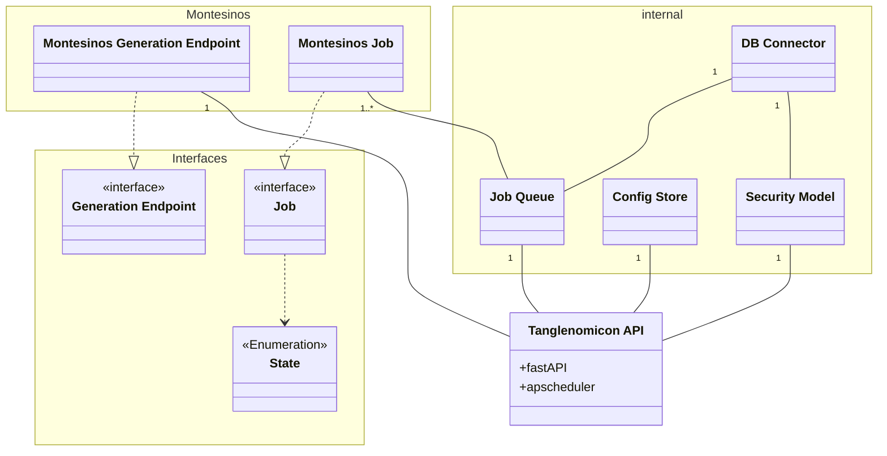

# Tanglenomicon Data Server API

The Tanglenomicon data server API describes the API provided by the Tanglenomicon to read/write to the mongodb.

# Planning

## Tasks

Tasks will be decomposed per feature. Each feature will include one or many endpoints. Issues will be tracked per report, combining where it makes sense.

## Version control

Version control will be git based with github as the source of truth. Work items will have a branch per work item. Merging a work item will be managed by github pull requests.

## Project Structure

Project structure will follow a standard python project structure

```
📦tanglenomicon_data_api
 ┣ 📂.github
 ┣ 📂docs
 ┣ 📂tanglenomicon_data_api
 ┣ 📂test
 ┣ 📜.flake8
 ┣ 📜.gitignore
 ┣ 📜LICENSE
 ┣ 📜README.md
 ┣ 📜requirements.txt
 ┗ 📜setup.py
```

- 📂tanglenomicon_data_api : Shall contains source code
- 📂test : Shall contain test code
- 📂docs : Shall contain documentation for specific features

## Define a unit

A unit in this project shall be a source file. Source files are expected to have a single public interface.

## Quality

This project will be a public API for the tanglenomicon project. This requires a high level of validation. With the primary design goal of never crashing. While api R/W failures are acceptable with reporting.

### Unit testing

Every unit is expected to have a unit test suite. Unit test suites are expected to flex every public interface of their unit. Code coverage is optional.

### Integration testing

Integration tests are expected for every program flow.

## Requirements

### Functional Requirements

Functional requirements are phrased as use cases and can be found in [docs/use_cases](docs/use_cases).


### Non-functional Requirements

* Must be packaged as a docker container
* Must run in linux

## Technologies

### Languages/Frameworks

The project will be written in python using the [fastapi](https://fastapi.tiangolo.com/) framework. All required packages are included in the `requirements.txt`

Using a vitrual environment is suggested from the root run in powershell:

```shell
python -m venv py_venv
.\py_venv\Scripts\Activate.ps1
pip install -r .\requirements.txt
```

#### Style Guide

All python files are expected to pass the configured flake8 without warnings this includes aligning to [https://github.com/psf/black](https://github.com/psf/black).

### Tools

* vscode
* mermaid.js
* plantUML
* python3
* pytest
* flake8
* git

# Design and Documentation


## System

### Block Diagram




## Units


Unit descriptions can be found in [docs/unit_description](./docs/unit_description).