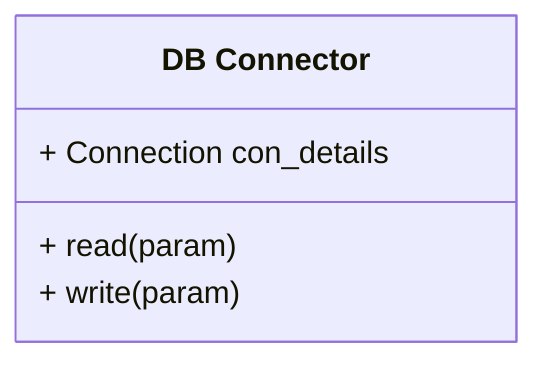

# Unit

Database connector

# Description

This unit provides an abstract read/write interface.

# Diagrams

```mermaid

classDiagram

class dc["DB Connector"]{
    + Connection con_details
    + read(param)
    + write(param)
}

```

# Unit test description

_List the unit tests for this unit_
s