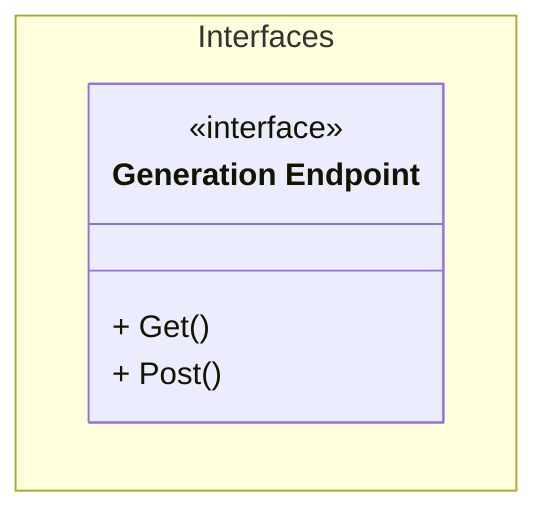

# Unit: Title

generation api endpoint

# Description

The generation endpoint interface. To be implemented by each generation use case.

# Diagrams

# Unit test description

Object defines an abstract interface no unit testing.
