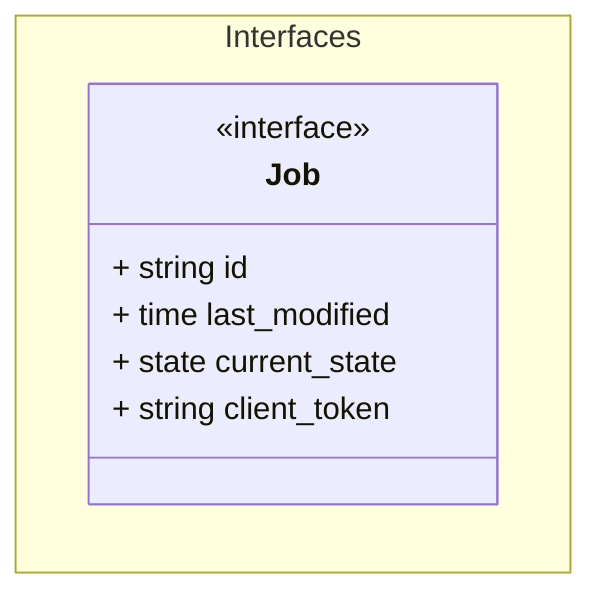

# Unit: Title

Job

# Description

The interface that describes the minimum members of the job class.

# Diagrams

```mermaid

classDiagram

namespace Interfaces {

    class aj["Job"]{
        <<interface>>
        + string id
        + time last_modified
        + state current_state
        + string client_token
    }

}

```

# Unit test description

_List the unit tests for this unit_
