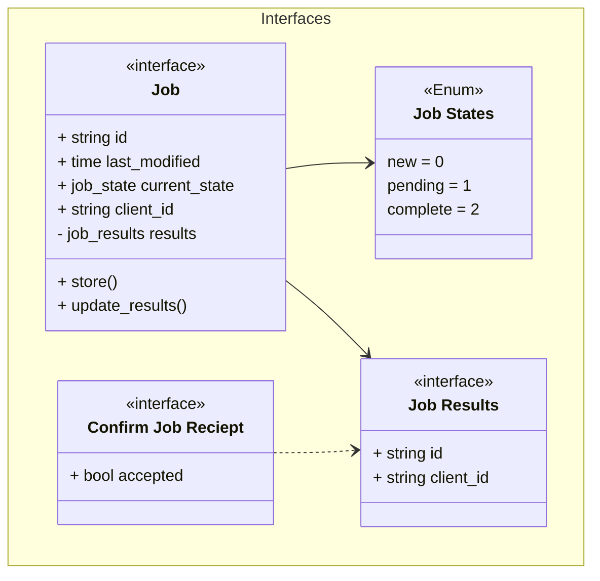

# Unit: Title

Job

# Description

The interface that describes the minimum members of the job class.

# Diagrams

```mermaid

classDiagram

namespace Interfaces {

    class js["Job States"]{
        <<Enum>>
        new = 0
        pending = 1
        complete = 2
    }

    class aj["Job"]{
        <<interface>>
        + string id
        + time last_modified
        + job_state current_state
        + string client_id
        - job_results results
        + store()
        + update_results()
    }
    class ajr["Job Results"]{
        <<interface>>
        + string id
        + string client_id
    }
    class cr["Confirm Job Reciept"]{
        <<interface>>
        + bool accepted
    }

}

aj --> js
aj --> ajr
cr ..> ajr
```

# Unit test description

Object defines an abstract interface no unit testing.
