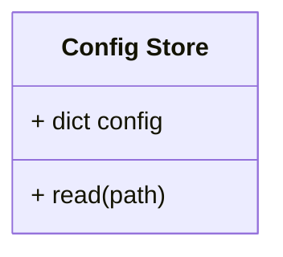

# Unit: Config Store

## Description

This unit reads the config data for the server from a yaml file.

## Diagrams

```mermaid

classDiagram

class dc["Config Store"]{
    + dict config
    + read(path)
}

```

## Unit test description

_List the unit tests for this unit_
