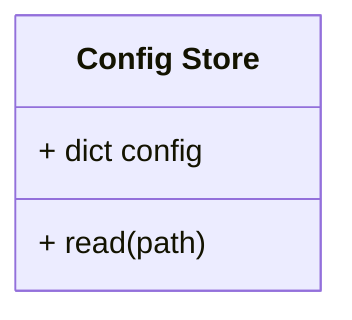

# Unit: Config Store

## Description

This unit reads the config data for the server from a yaml file.

## Diagrams

## Unit test description

These tests will be run manually.

### Load Config

#### Positive Tests

Test that a config can be loaded.

##### Inputs:

-   Valid config

##### Expected Output:

Config loaded.

#### Negative Tests

##### Invalid config

Tests the behavior when invalid config are passed.

###### Inputs:

-   Invalid config

###### Expected Output:

An exception is raised.
