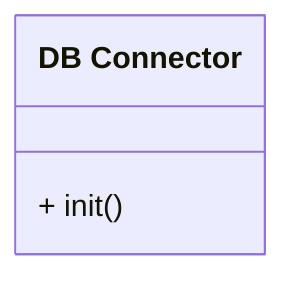

# Unit: Database connector

## Description

This unit provides an abstract database interface. Motor handles the "day to day" db operations.

## Diagrams

## Unit test description

_List the unit tests for this unit_
