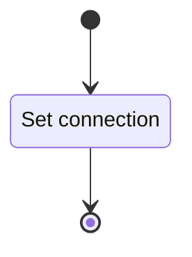

# Unit: Database connector

## Description

This unit provides an abstract database interface. Motor handles the "day to day" db operations.

## Diagrams

### Load Database

## Unit test description

These tests will be run manually.

### Load Database

#### Positive Tests

Test that a database can be connected to.

##### Inputs:

-   Valid credentials

##### Expected Output:

Connection is made.

#### Negative Tests

##### Invalid connection

Tests if the behavior when invalid credentials are passed.

###### Inputs:

-   Invalid credentials

###### Expected Output:

An exception is raised.
