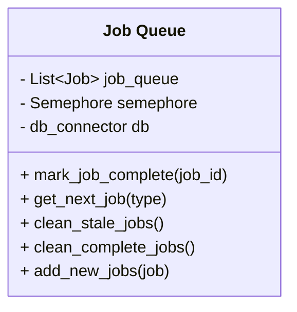
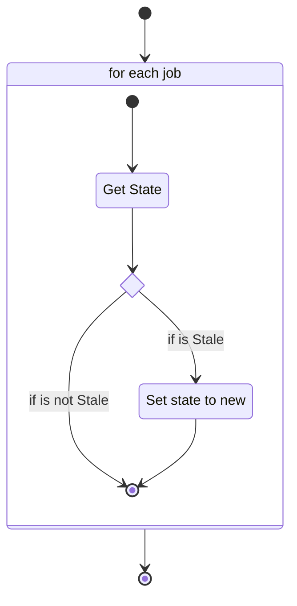
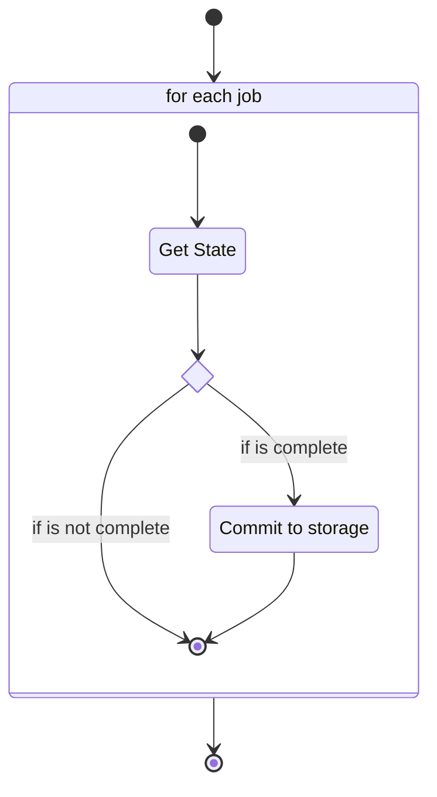
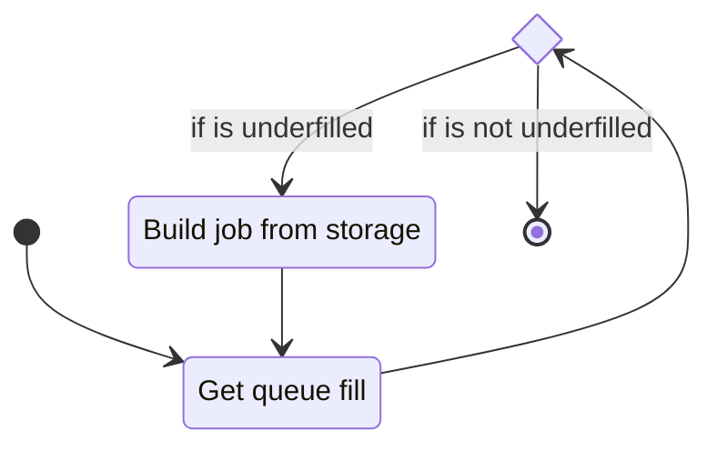
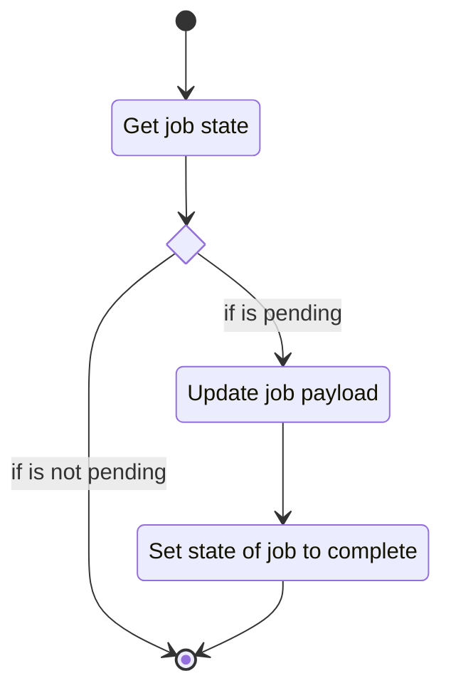
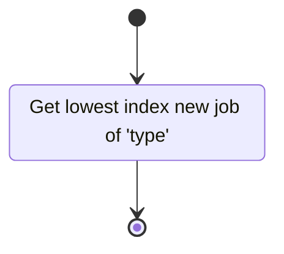

# Unit: Job Queue

## Description

This class defines the job queue. This is used to hold the current job states for the server.

## Diagrams

## Function flow

### clean_stale_jobs

### clean_complete_jobs

### add_new_jobs

### mark_job_complete

### get_next_job

## Unit test description

Unit has no stand alone functionality.