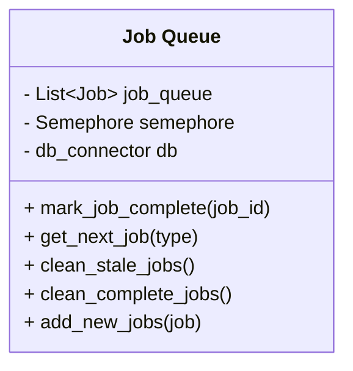
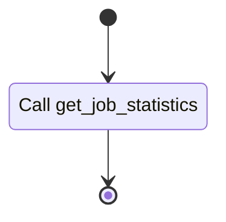
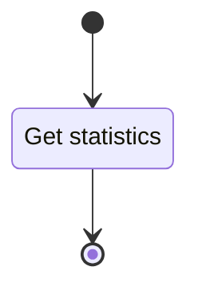
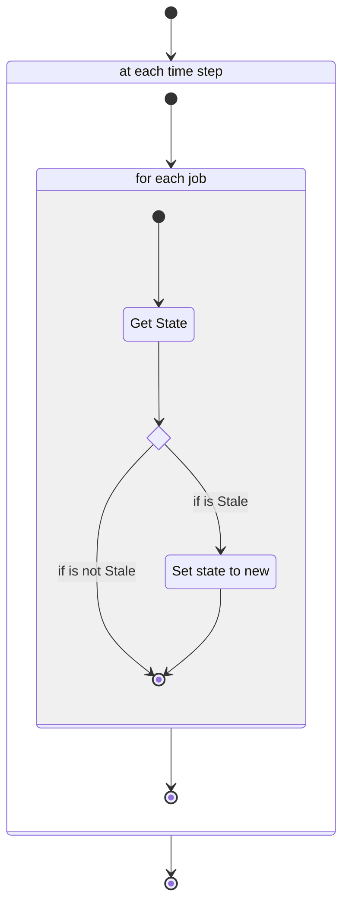
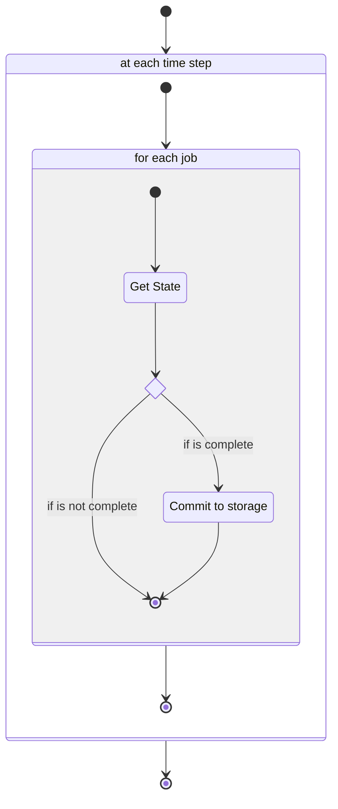
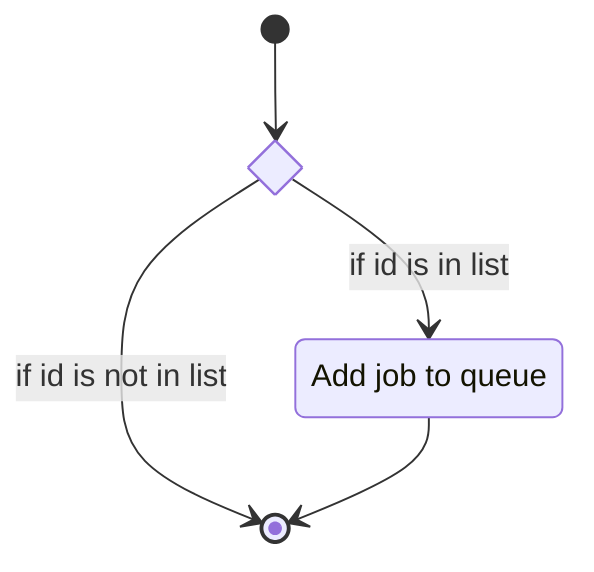
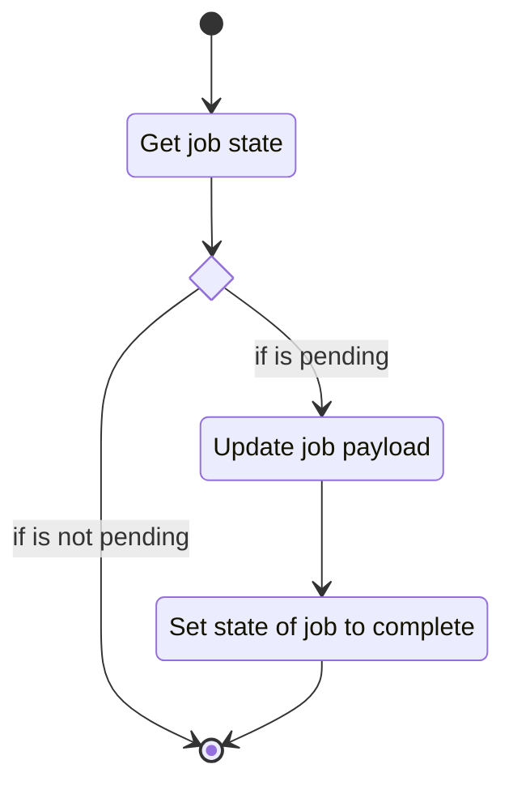
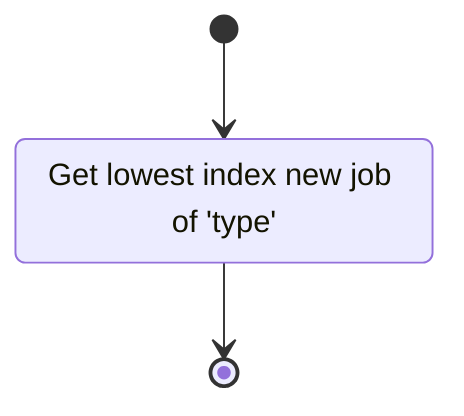

# Unit: Job Queue

## Description

This class defines the job queue. This is used to hold the current job states for the server.

## Diagrams

## Function flow

### retrieve_job_statistics

### get_job_statistics

### task_clean_stale_jobs

### task_clean_complete_jobs

### enqueue_job

### mark_job_complete

### get_next_job

## Unit test description

---

### retrieve_job_statistics endpoint

#### Positive Test

Job queue stats are correctly reported.

##### Inputs:

-   Mocked job_queue with variable job counts in each state.

##### Expected Output:

Jobs reported with correct counts.

#### Negative Tests

I can't think of any.

---

### get_job_statistics

#### Positive Test

##### Default type

Job queue stats are correctly reported.

###### Inputs:

-   Mocked job_queue with variable job counts in each state.

###### Expected Output:

Jobs reported with correct counts.

##### Specific type

Tests behaviour when job queue stats are requested for a specific class type.

###### Inputs:

-   Mocked job_queue with variable job counts in each state and multiple types.

###### Expected Output:

Jobs reported with correct counts.

#### Negative Tests

##### Nonexistent type

Tests behaviour when requesting type not in queue.

###### Inputs:

-   Mocked job_queue with variable job counts in each state.

###### Expected Output:

Jobs reported with correct counts.

---

### task_clean_stale_jobs

#### Positive Tests

##### Job Queue has stale jobs

Tests normal program flow.

###### Inputs:

-   job queue has stale jobs.

###### Expected Output:

stale jobs have been set as new.

##### Job Queue has no stale jobs

Tests normal program flow.

###### Inputs:

-   job queue has no stale jobs.

###### Expected Output:

Job queue shows no changes.

#### Negative Tests

##### Job queue is empty

Tests behaviour when job queue is empty.

###### Inputs:

-   job queue has no jobs.

###### Expected Output:

Job queue shows no changes.

---

### task_clean_complete_jobs

##### Job Queue has complete jobs

Tests normal program flow.

###### Inputs:

-   job queue has complete jobs.

###### Expected Output:

complete jobs have been set as new.

##### Job Queue has no complete jobs

Tests normal program flow.

###### Inputs:

-   job queue has no complete jobs.

###### Expected Output:

Job queue shows no changes.

#### Negative Tests

##### Job queue is empty

Tests behaviour when job queue is empty.

###### Inputs:

-   job queue has no jobs.

###### Expected Output:

Job queue shows no changes.

---

### enqueue_job

#### Positive Tests

##### Job not in queue

Tests the normal program flow.

###### Inputs:

-   job queue is empty.

###### Expected Output:

Enqueue succeeds returning true.

#### Negative Tests

##### Job in queue

Tests behaviour when attempting to enqueue job already in queue.

###### Inputs:

-   job queue has job already enqueued.

###### Expected Output:

Enqueue fails returning false.

#### Negative Tests

I can't think of any.

---

### mark_job_complete

#### Positive Tests

##### Request with job in queue

Tests the normal program flow.

###### Inputs:

-   job queue has pending jobs.

###### Expected Output:

Requested job is marked as complete.

#### Negative Tests

##### Job not in queue

Tests behaviour when requested job is not in queue.

###### Inputs:

-   job queue is empty.

###### Expected Output:

Mark returns false.

##### Job not in pending

Tests behaviour when requested job is not in queue

###### Inputs:

-   job queue has new but no pending jobs.

###### Expected Output:

Function returns false.

##### Client mismatch

Tests behaviour when requested job is reported by the wrong client.

###### Inputs:

-   job queue has jobs in pending.

###### Expected Output:

Function returns false.

---

### get_next_job

#### Positive Tests

##### Request with jobs in queue

Tests the normal program flow.

###### Inputs:

-   job queue has new jobs.

###### Expected Output:

job found and is marked as pending.

#### Negative Tests

##### Jobs not in queue

Tests behaviour when job queue is empty.

###### Inputs:

-   job queue is empty.

###### Expected Output:

An exception is raised.

##### Job not in pending

Requested job is not in queue.

###### Inputs:

-   job queue has new but no pending jobs.

###### Expected Output:

A None object is returned.