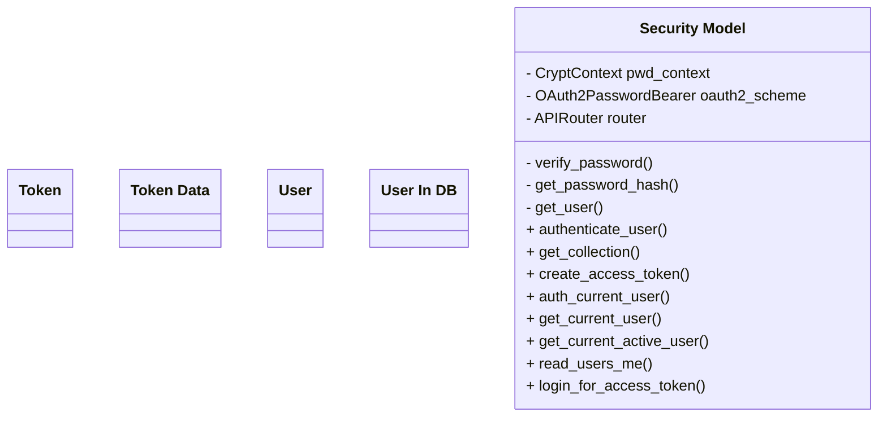
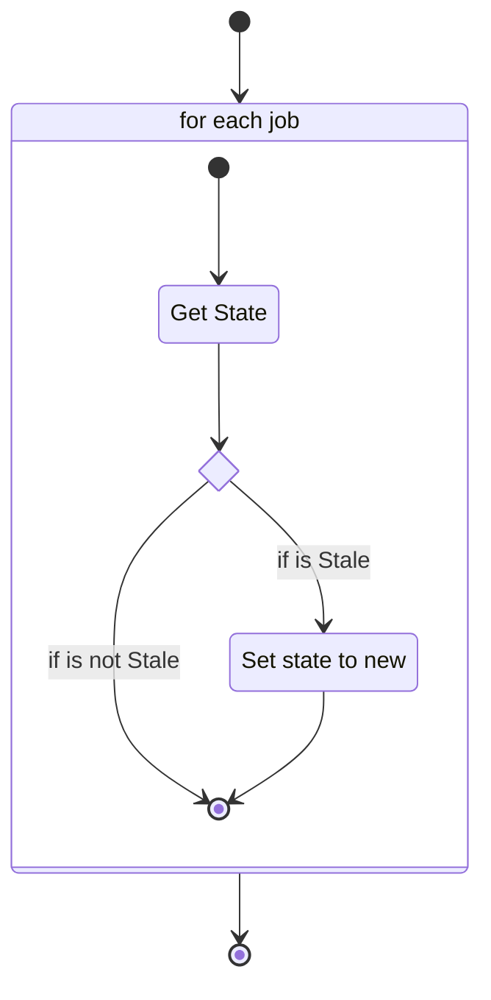
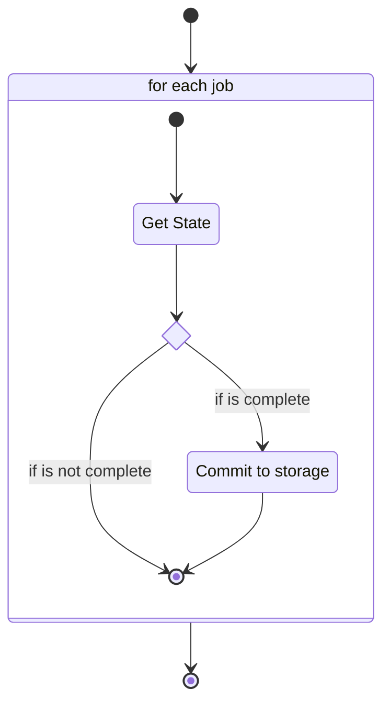
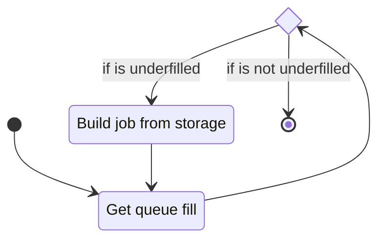
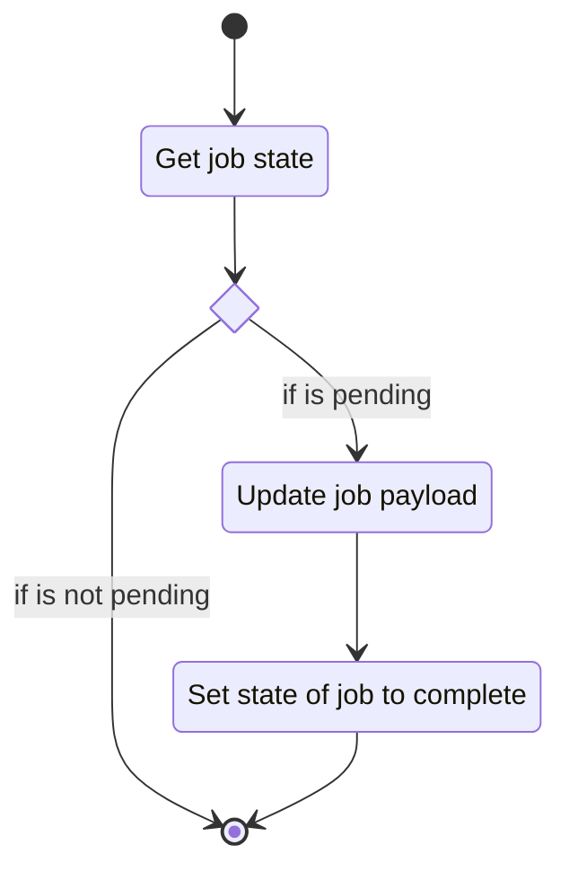
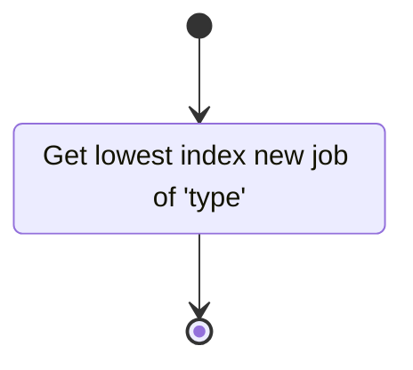

# Unit: Security Model

## Description

This class defines the secturity model for the tanglenomicon api. It's mostly wholsale lifted from [FastAPI docs](https://web.archive.org/web/20240324095137/https://fastapi.tiangolo.com/tutorial/security/oauth2-jwt/)

## Diagrams

## Function flow

### clean_stale_jobs

### clean_complete_jobs

### add_new_jobs

### mark_job_complete

### get_next_job

## Unit test description

These tests will be run manually. Since this is lifted from the fastAPI guide
we trust it, this is perhaps a dubious thing to do.
