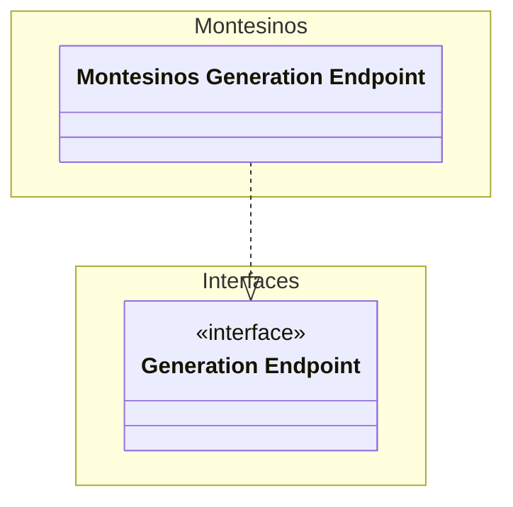
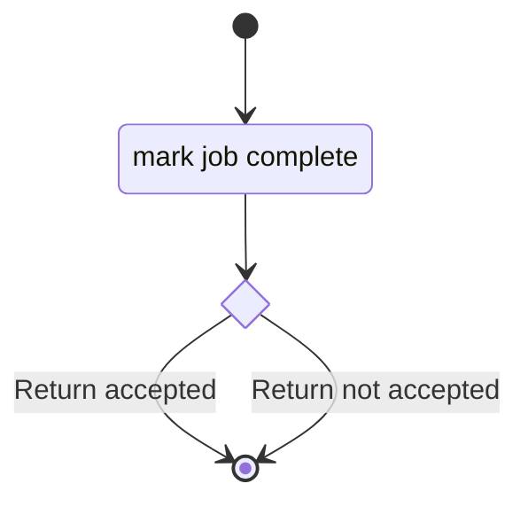
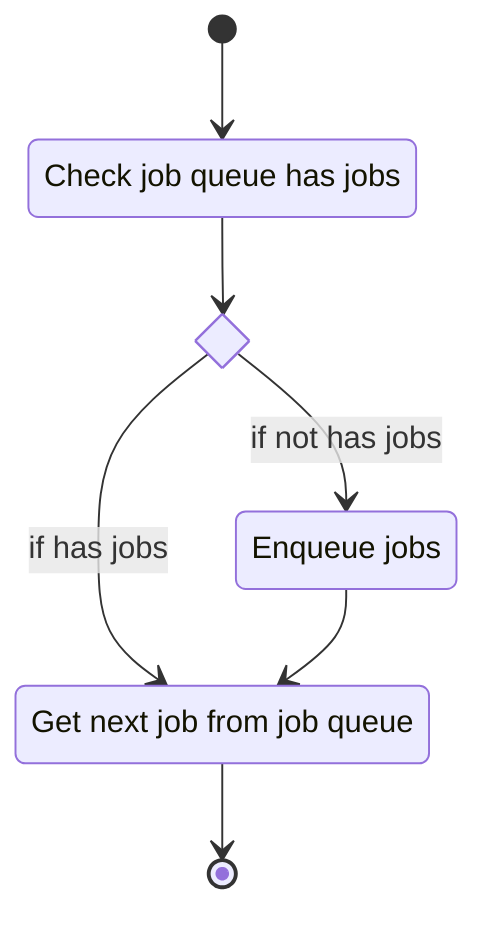
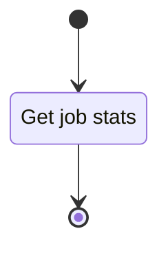

# Unit: Montesinos api endpoint

## Description

Implementation of the generation endpoint interface for the Montesinos use case.

## Diagrams

### report_montesinos_job

### retrieve_montesinos_job

### retrieve_montesinos_job_queue_stats

## Unit test description

### retrieve_montesinos_job_queue_stats

#### Positive Test

Job queue stats are correctly reported

##### Inputs:

-   Mocked job_queue with variable job counts in each state

##### Expected Output:

Jobs reported with correct counts.

#### Negative Tests

I can't think of any at the moment.

### retrieve_montesinos_job

#### Positive Test

##### Job queue has new jobs

A job is served to the client.

###### Inputs:

-   Mocked job queue with jobs in new.
-   Mocked valid stencil collection.
-   Mocked valid rational collection.
-   min-new-count set to 2.

###### Expected Output:

Retrieve job with id matching the job in the new state.

##### Job queue has no new jobs

A job is enqueued and is served to the client.

###### Inputs:

-   Mocked with empty job queue.
-   Mocked valid stencil collection.
-   Mocked valid rational collection.
-   min-new-count set to 2.

###### Expected Output:

Retrieve job with id matching the job in the new state.

#### Negative Tests

I can't think of any.

### report_montesinos_job

#### Positive Test

Job in job queue with matching id is marked complete and results are updated.

##### Inputs:

-   Mocked job queue with jobs in pending.
-   Mocked valid stencil collection.
-   Mocked valid rational collection.
-   min-new-count set to 2.

##### Expected Output:

Enqueue jobs with correct id

#### Negative Tests

##### Job not in queue

Job in job queue with matching id is marked complete and results are updated.

###### Inputs:

-   Mocked job queue with jobs in pending.
-   Mocked valid stencil collection.
-   Mocked valid rational collection.
-   min-new-count set to 2.

###### Expected Output:

Reports a an error to the client.

##### Job not assigned to client

Job in job queue with matching id is marked complete and results are updated.

###### Inputs:

-   Mocked job queue with jobs in pending.
-   Mocked valid stencil collection.
-   Mocked valid rational collection.
-   min-new-count set to 2.

###### Expected Output:

Reports a an error to the client.
