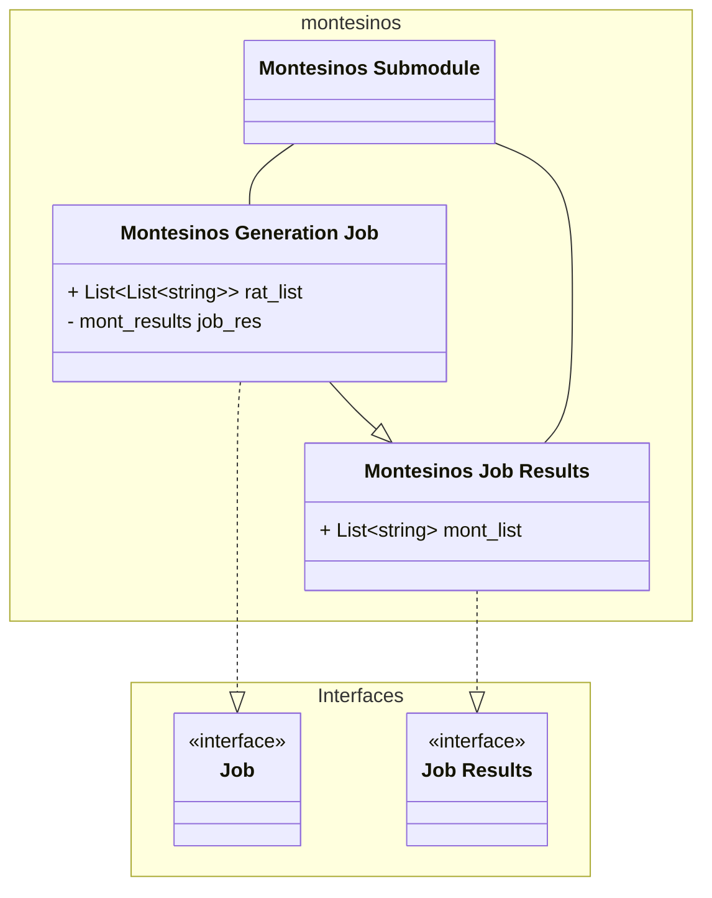
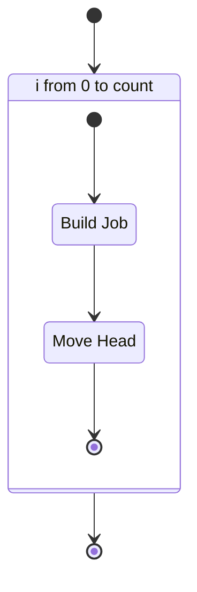
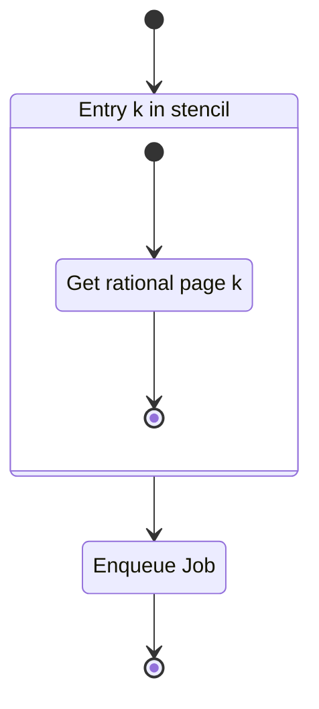
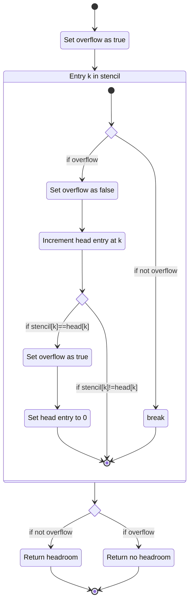
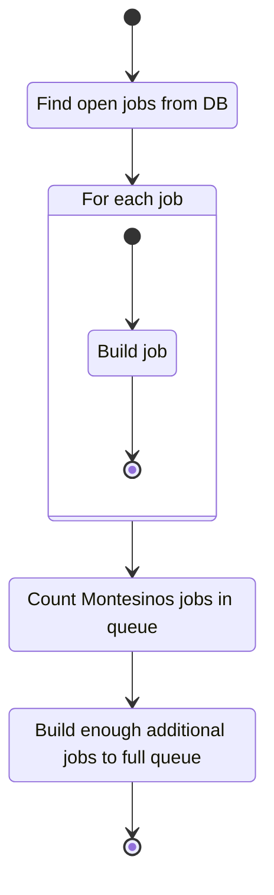

# Unit: Montesinos job

## Description

Implementation of the Job interface for the Montesinos job type.

### Strategy

Info on abstract strategy can be found in the core project.

## Diagrams

### Class diagram

### Get Jobs

Retrieve $n$ jobs for $n\in \Z^+$

#### Build Job

#### Move Head

### Startup

### Store

## Unit test description

### Get Jobs

#### Positive Tests

##### Requested count is 2

This tests the behavior of the get jobs function when the requested count is 2.
This is the normal positive behaviour.

###### Inputs:

-   Mocked stencil collection two stencils one with no headroom.
-   Mocked valid rational collection.
-   Count set to 2.

###### Expected Output:

The system is expected to return and enqueue 2 jobs. Stencils updated with open jobs

#### Negative Tests

##### Stencil collection is empty

This tests the behavior of the get jobs function when an empty Stencil collection
is provided.

###### Inputs:

-   Mocked empty stencil collection.
-   Mocked valid rational collection.
-   Count set to 2.

###### Expected Output:

The system is expected to return and enqueue no data.

##### Rational collection is empty

This tests the behavior of the get jobs function when an empty rational collection
is provided.

###### Inputs:

-   Mocked valid stencil collection.
-   Mocked empty rational collection.
-   Count set to 2.

###### Expected Output:

The system is expected to raise an empty rational exception.

##### Requested count is 0

This tests the behavior of the get jobs function when the requested count is 0.

###### Inputs:

-   Mocked valid stencil collection.
-   Mocked valid rational collection.
-   Count set to 0.

###### Expected Output:

The system is expected to return and enqueue no data.

### Startup Task

#### Positive Tests

##### Load from collection

Successfully loads open jobs from collection.

###### Inputs:

-   Mocked valid stencil collection with min-new-count - 1 open jobs
-   Mocked valid rational collection

###### Expected Output:

Enqueue jobs with correct id

##### Collection has no open jobs

Collection has no open jobs so new jobs are created.

###### Inputs:

-   Mocked valid stencil collection with all stencils in new state
-   Mocked valid rational collection
-   Empty job queue

###### Expected Output:

Enqueue new jobs.

#### Negative Tests

I can't think of any at the moment.

### MontesinosJob.Store

#### Positive Test

Results are stored to database and stencil is updated

##### Inputs:

-   Mocked valid stencil collection with min-new-count - 1 open jobs
-   Mocked valid rational collection

##### Expected Output:

Enqueue jobs with correct id

#### Negative Tests

I can't think of any at the moment.