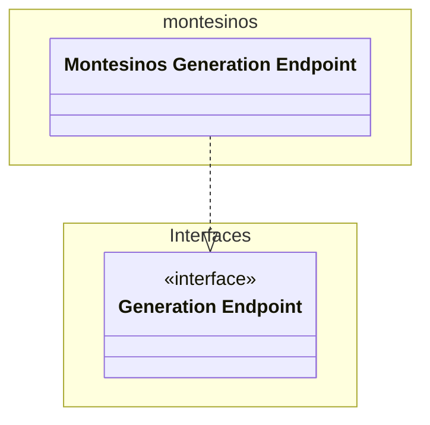

# Unit: Title

Montesinos api endpoint

# Description

Implementation of the generation endpoint interface for the Montesinos use case.

# Diagrams

# Unit test description

_List the unit tests for this unit_
