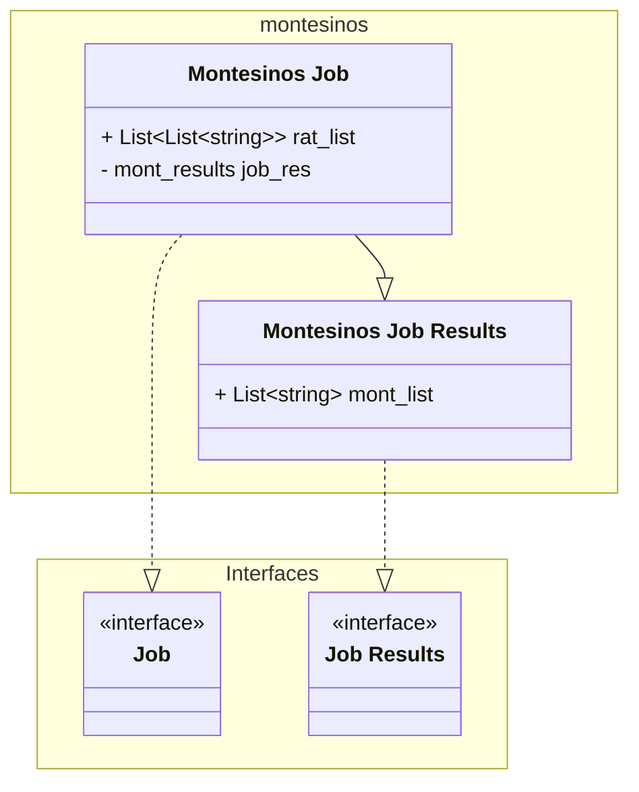

# Unit: Title

Montesinos job

# Description

Implementation of the Job interface for the Montesinos job type.

# Diagrams

```mermaid

classDiagram

namespace Interfaces {

    class aj["Job"]{
        <<interface>>
    }
    class ajr["Job Results"]{
        <<interface>>
    }

}


namespace montesinos {

    class mj["Montesinos Job"]{
        + List~List~string~~ rat_list
        - mont_results job_res
    }
    class mjr["Montesinos Job Results"]{
        + List~string~ mont_list
    }

}


mj ..|> aj
mjr ..|> ajr
mj --|> mjr

```

# Unit test description

_List the unit tests for this unit_
