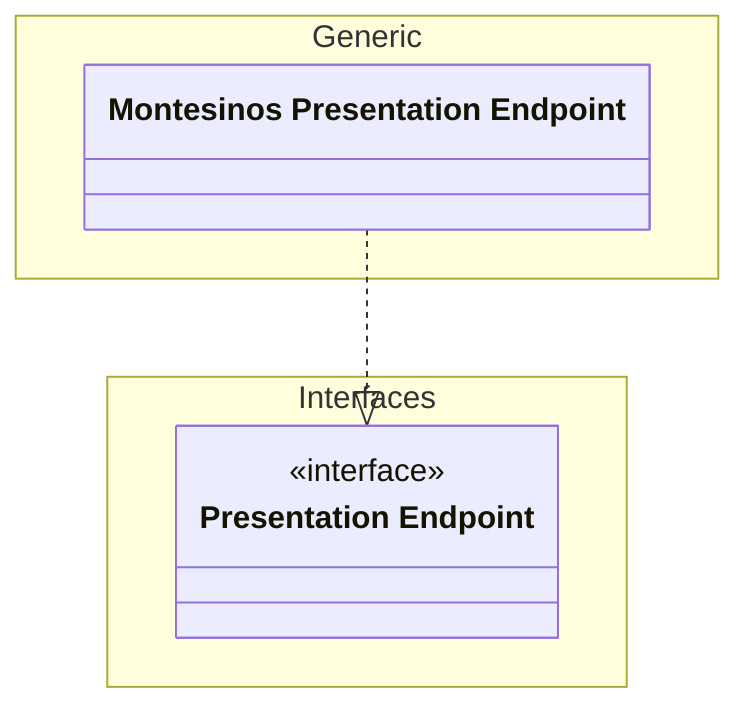
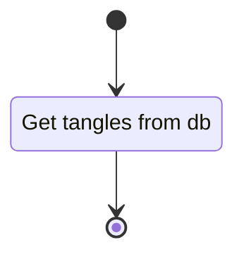

# Unit: Montesinos api presentation endpoint

## Description

Implementation of the presentation endpoint interface for the montesinos tangle use case.

## Diagrams

### get_tangles

## Unit test description

### get_tangle_by_id

#### Positive Test

##### test

[//]: # (@@@ TODO: )

###### Inputs:

[//]: # (@@@ TODO: )

###### Expected Output:

[//]: # (@@@ TODO: )

#### Negative Tests

##### test

[//]: # (@@@ TODO: )

##### Inputs:

[//]: # (@@@ TODO: )

##### Expected Output:

[//]: # (@@@ TODO: )
