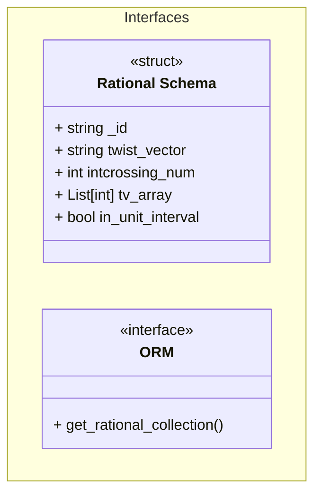

# Unit Rational ORM

## Description

Describes the orm module for the rational tangle module. 

## Diagrams

```mermaid

classDiagram
    namespace Interfaces {
        class schema["Rational Schema"] {
            <<struct>>
            + string _id
            + string twist_vector
            + int intcrossing_num
            + List[int] tv_array
            + bool in_unit_interval
        }

        class age["ORM"] {
            <<interface>>
            + get_rational_collection()
        }
    }
```

## Unit test description

No testing required for data only classes.