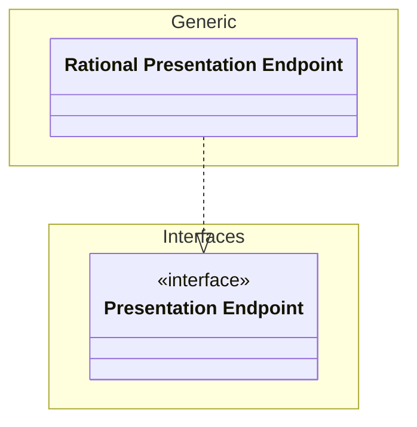
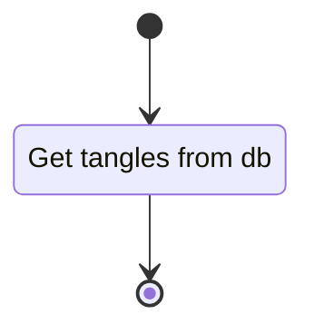

# Unit: rational api presentation endpoint

## Description

Implementation of the presentation endpoint interface for the rational tangle use case.

## Diagrams

### get_tangles

## Unit test description

### get_tangles

#### Positive Test

Retrieve a page of tangles.

###### Inputs:

Populated tangle database.

###### Expected Output:

A page of tangles are returned.

#### Negative Tests

##### Empty table

Attempt to retrieve a tangle from an empty tangle.

###### Inputs:

Empty tangle.

###### Expected Output:

Empty list is returned.

##### Zero size request

Attempt to retrieve no tangles from the tangle table.

###### Inputs:

Populated tangle database.

###### Expected Output:

Empty list is returned. 