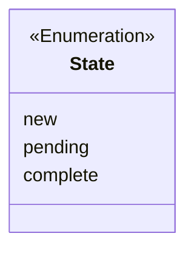

# Unit

State

# Description

Enumeration that defines job states.

# Diagrams

```mermaid

classDiagram

    class es["State"]{
        <<Enumeration>>
        new
        pending
        complete
    }

```

# Unit test description

Unit has no stand alone functionality.