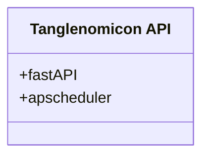

# Unit

Tanglenomicon API

# Description

This is the base module for the api. It contains the definition for apscheduler and fastAPI.

# Diagrams

# Unit test description

Unit has no stand alone functionality.